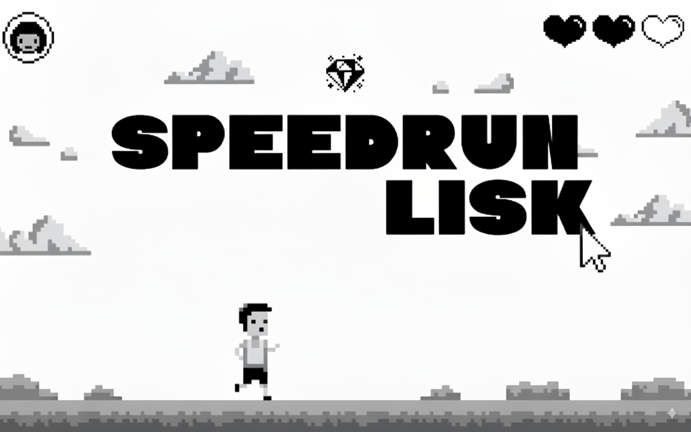

# SpeedRunLisk



SpeedRunLisk - Learn Solidity development on the Lisk blockchain through interactive challenges. Based on [SpeedRunEthereum](https://github.com/BuidlGuidl/SpeedRunEthereum) and built with [Scaffold-Lisk](https://github.com/LiskHQ/scaffold-lisk), adapted for the Lisk ecosystem. An expanded experience for builders where you'll be able to unlock your builder profile after completing a few challenges. This will open the gates to:

-   Interact with other BuidlGuidl curriculums like [ETH Tech Tree](https://www.ethtechtree.com/) and [BuidlGuidl CTF](https://ctf.buidlguidl.com/)
-   Share your builds and discover what other builders are up to
-   Earn badges

You can find the repository containing the challenges [here](https://github.com/scaffold-eth/se-2-challenges).

## Contributing

We welcome contributions! Please see our [Contributing Guide](./CONTRIBUTING.md) for details on how to get started, development workflow, and guidelines for submitting pull requests.

## Requirements

Before you begin, you need to install the following tools:

-   [Node (>= v22.18.0)](https://nodejs.org/en/download/)
-   Yarn ([v1](https://classic.yarnpkg.com/en/docs/install/) or [v2+](https://yarnpkg.com/getting-started/install))
-   [Git](https://git-scm.com/downloads)
-   [Docker Engine](https://docs.docker.com/engine/install/)

## Development Quickstart

1. Install dependencies

```
yarn install
```

2. Spin up the Postgres database service + create database + seed

```
docker compose up -d
yarn drizzle-kit migrate
yarn db:seed
```

3. Start your NextJS app:

```
yarn start
```

Visit your app on: `http://localhost:3000`.

4. You can explore the database with:

```
yarn drizzle-kit studio
```

### Database Information

We are using Drizzle with Postgres for database management. You can run `drizzle-kit` commands from the root with `yarn drizzle-kit`.

### Database Migration

Anytime we update the schema in `packages/nextjs/services/database/config/schema.ts`, we can generate a migration with:

```
yarn drizzle-kit generate
```

Then we can apply the migration with:

```
yarn drizzle-kit migrate
```

We also need to make sure we commit the migration to the repo.

### Database (dev info)

To iterate fast on the database locally:

-   Tweak the schema in `schema.ts`
-   Run `yarn drizzle-kit push` to apply the changes.
-   Copy `seed.data.example.ts` to `seed.data.ts`, tweak as needed and run `yarn db:seed` (will delete existing data)

### Firebase image upload

1. In the Firebase Console, go to "Project settings" (the gear icon)
2. Navigate to the "Service accounts" tab
3. Click "Generate new private key" for the Firebase Admin SDK
4. Save the JSON file securely

5. In `.env.local` file in the `packages/nextjs` directory, add the following variables:

```
FIREBASE_SERVICE_ACCOUNT_KEY='{
  "type": "service_account",
  "project_id": "your-project-id",
  ...,
}'

FIREBASE_STORAGE_BUCKET=your-project-id.appspot.com
```

Replace the content of `FIREBASE_SERVICE_ACCOUNT_KEY` with the JSON content from your service account key file (wrap the json in single quotes).

The `FIREBASE_STORAGE_BUCKET` should be set to your Firebase Storage bucket name, typically in the format `your-project-id.appspot.com`.
